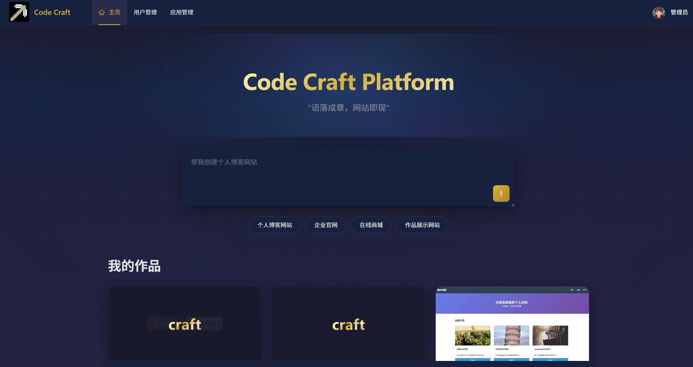
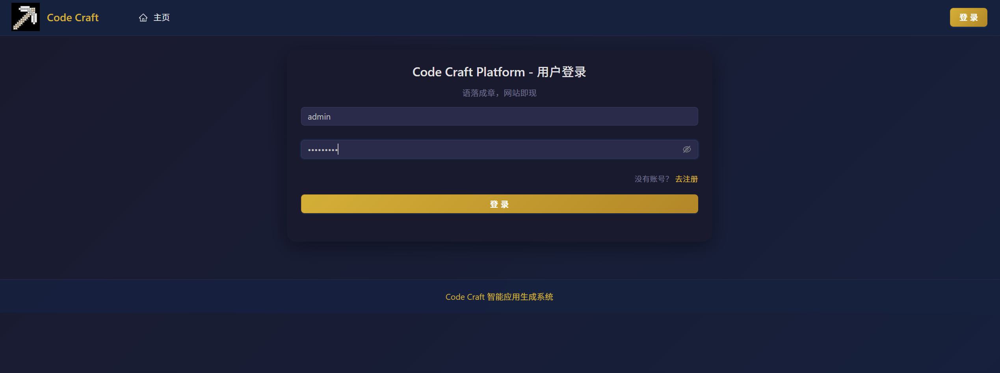
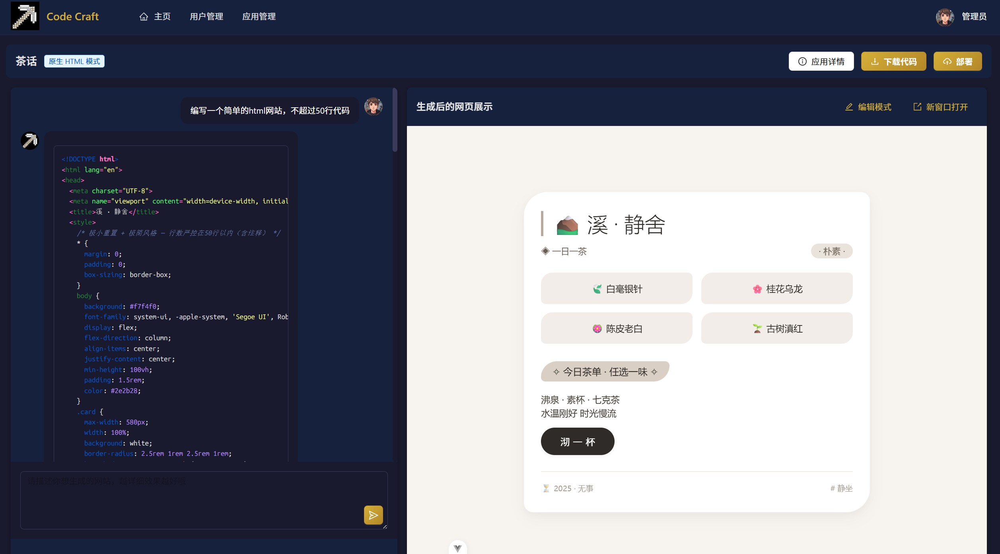

# Code Craft 智能应用生成系统

[](LICENSE)


## 📖 项目简介

Code Craft 智能应用生成系统是一个全栈 AI 代码生成平台，用户可以通过与 AI 对话来创建网站应用、实时查看生成的网站效果、部署应用、管理个人应用等。项目采用前后端分离架构，支持单体架构和微服务架构两种部署方式。

### 项目预览

#### 首页


#### 登录页


#### 对话页


### ✨ 核心特性

- 🤖 **AI 对话生成代码**：通过与 AI 对话生成网站应用代码，支持实时预览
- 🎨 **多类型代码生成**：支持 HTML 单文件、多文件项目、Vue.js 项目等多种代码生成模式
- 🔄 **实时预览**：在对话过程中实时查看生成的网站效果
- 🚀 **一键部署**：将生成的网站部署到云端，生成可访问的 URL
- 📊 **完整管理系统**：支持用户管理、应用管理、权限控制等功能
- ⚡ **流式响应**：基于 Server-Sent Events (SSE) 实现实时流式输出
- 🔧 **多模型支持**：支持 OpenAI、DeepSeek、阿里云通义千问等多种 AI 模型

## 🏗️ 系统架构

### 架构概览

项目支持两种架构模式：

1. **单体架构**：Spring Boot 单体应用 + Vue 3 前端
2. **微服务架构**：基于 Spring Cloud Alibaba 的微服务架构

### 技术栈

#### 后端技术栈

- **基础框架**：Spring Boot 3.5.10 + Java 21 + Maven
- **数据库**：MySQL 8.0+ + MyBatis-Flex ORM
- **AI 框架**：LangChain4j 1.1.0
- **AI 模型集成**：
  - OpenAI GPT 模型
  - DeepSeek 模型
  - 阿里云 DashScope 通义千问模型
- **流式输出**：LangChain4j Reactor (SSE 流式输出)
- **缓存**：Redis（使用 Redisson 客户端）
- **对象存储**：腾讯云 COS（存储生成的静态资源）
- **网页截图**：Selenium + WebDriverManager（生成应用预览图）
- **API 文档**：Knife4j (Swagger UI)
- **监控**：Spring Boot Actuator + Prometheus
- **会话管理**：Spring Session + Redis
- **限流**：基于注解的用户级限流

#### 前端技术栈

- **框架**：Vue 3 + TypeScript
- **UI 组件库**：Ant Design Vue
- **状态管理**：Pinia
- **路由管理**：Vue Router 4
- **构建工具**：Vite
- **HTTP 客户端**：Axios
- **时间处理**：Day.js
- **代码规范**：ESLint + Prettier

#### 微服务架构（可选）

- **服务发现**：Spring Cloud Alibaba Nacos
- **服务调用**：Apache Dubbo 3.3.0
- **配置中心**：Spring Cloud Config
- **网关**：Spring Cloud Gateway
- **熔断降级**：Sentinel

## 📋 功能特性

### 用户功能

- 🚀 **应用创建**：输入提示词创建应用
- 💬 **AI 对话**：通过对话生成网站应用，实时查看效果
- 📝 **应用管理**：修改应用信息（应用名称）
- 🗑️ **应用删除**：删除自己的应用
- 👀 **应用查看**：查看应用详情和生成效果
- 🚀 **应用部署**：部署应用到云端
- 📋 **应用列表**：分页查询自己的应用列表（支持根据名称查询）
- ⭐ **精选应用**：分页查询精选的应用列表

### 管理员功能

- 🔧 **应用管理**：删除任意应用
- ✏️ **应用编辑**：更新任意应用信息（应用名称、应用封面、优先级）
- 📊 **应用查询**：分页查询应用列表（支持多字段查询）
- 👁️ **应用查看**：查看任意应用详情
- ⭐ **精选设置**：设置应用为精选（优先级99）

## 🚀 快速开始

### 环境要求

#### 后端环境
- JDK 21+
- Maven 3.6+
- MySQL 8.0+
- Redis 6.0+

#### 前端环境
- Node.js 18+
- npm / yarn / pnpm

### 数据库初始化

1. 创建数据库：
```sql
CREATE DATABASE IF NOT EXISTS code_craft;
USE code_craft;
```

2. 执行建表 SQL（位于 `sql/create_table.sql`）：
```bash
mysql -u root -p code_craft < sql/create_table.sql
```

### 后端启动

1. **克隆项目**
```bash
git clone https://github.com/Lzh-hub-theo/code-craft.git
```

2. **配置环境变量**
   - 复制 `src/main/resources/application-local.yml` 为 `application-local-custom.yml`
   - 修改数据库连接信息
   - 配置 AI 模型 API Key（替换示例中的 key）

3. **启动应用**
```bash
# 使用 Maven 编译和运行
mvn clean compile
mvn spring-boot:run

# 或者直接运行
./mvnw spring-boot:run
```

应用默认运行在 `http://localhost:8123`，API 文档地址：`http://localhost:8123/api/doc.html`

### 前端启动

1. **进入前端目录**
```bash
cd code-craft-frontend
```

2. **安装依赖**
```bash
npm install
# 或
yarn install
# 或
pnpm install
```

3. **配置环境变量**
创建 `.env.local` 文件：
```env
# API 基础地址
VITE_API_BASE_URL=http://localhost:8123/api
# 部署域名
VITE_DEPLOY_DOMAIN=http://localhost
```

4. **启动开发服务器**
```bash
npm run dev
```

前端默认运行在 `http://localhost:5173`

## ⚙️ 详细配置

### 后端配置

#### 数据库配置
修改 `src/main/resources/application.yml`：
```yaml
spring:
  datasource:
    url: jdbc:mysql://localhost:3306/code_craft
    username: your_username
    password: your_password
```

#### Redis 配置
```yaml
spring:
  data:
    redis:
      host: localhost
      port: 6379
      password: your_password
      database: 0
```

#### AI 模型配置
修改 `src/main/resources/application-local.yml`：

1. **DeepSeek 配置**：
```yaml
langchain4j:
  open-ai:
    chat-model:
      base-url: https://api.deepseek.com
      api-key: your_deepseek_api_key
      model-name: deepseek-chat
```

2. **阿里云 DashScope 配置**：
```yaml
langchain4j:
  open-ai:
    routing-chat-model:
      base-url: https://dashscope.aliyuncs.com/compatible-mode/v1
      api-key: your_dashscope_api_key
      model-name: qwen-turbo
```

3. **腾讯云 COS 配置**（用于部署）：
```yaml
cos:
  client:
    host: https://your-bucket.cos.ap-guangzhou.myqcloud.com
    secretId: your_secret_id
    secretKey: your_secret_key
    region: ap-guangzhou
    bucket: your-bucket
```

#### 其他配置
- **Pexels API Key**：用于图片搜索
- **DashScope Image Model**：用于图片生成

### 前端配置

#### API 地址配置
创建 `code-craft-frontend/.env.local`：
```env
VITE_API_BASE_URL=http://localhost:8123/api
VITE_DEPLOY_DOMAIN=http://localhost
```

#### 生产环境配置
创建 `code-craft-frontend/.env.production`：
```env
VITE_API_BASE_URL=https://api.your-domain.com
VITE_DEPLOY_DOMAIN=https://your-domain.com
```

## 📁 项目结构

### 单体架构结构

```
code-craft/
├── src/main/java/com/craft/ai/codecraft/
│   ├── ai/                         # AI 相关服务
│   │   ├── model/                  # AI 模型定义
│   │   ├── tools/                  # AI 工具（文件操作等）
│   │   └── guardrail/              # AI 安全防护
│   ├── config/                     # 配置类
│   ├── controller/                 # 控制器
│   ├── model/                      # 数据模型
│   │   ├── dto/                    # 数据传输对象
│   │   ├── enums/                  # 枚举类
│   │   ├── vo/                     # 视图对象
│   │   └── entity/                 # 实体类（通过 MyBatis-Flex 生成）
│   ├── service/                    # 服务层
│   ├── mapper/                     # 数据访问层
│   ├── langgraph4j/                # LangGraph 工作流
│   │   ├── node/                   # 工作流节点
│   │   ├── tools/                  # 工作流工具
│   │   ├── ai/                     # AI 服务
│   │   └── state/                  # 工作流状态
│   ├── core/                       # 核心模块
│   │   ├── handler/                # 流处理器
│   │   ├── parser/                 # 代码解析器
│   │   └── saver/                  # 文件保存器
│   ├── utils/                      # 工具类
│   ├── ratelimit/                  # 限流模块
│   ├── monitor/                    # 监控模块
│   ├── common/                     # 公共模块
│   ├── manager/                    # 管理器
│   ├── annotation/                 # 自定义注解
│   ├── aop/                        # 切面编程
│   ├── constant/                   # 常量定义
│   ├── exception/                  # 异常处理
│   └── CodeCraftApplication.java   # 应用启动类
├── src/main/resources/
│   ├── application.yml             # 主配置文件
│   ├── application-local.yml       # 本地配置文件
│   ├── application-prod.yml        # 生产配置文件
│   ├── mapper/                     # MyBatis XML 映射文件
│   ├── prompt/                     # AI 提示词模板
│   └── static/                     # 静态资源
├── code-craft-frontend/            # 前端项目
│   ├── src/
│   │   ├── api/                    # API 接口定义
│   │   ├── components/             # 公共组件
│   │   ├── layouts/                # 布局组件
│   │   ├── pages/                  # 页面组件
│   │   ├── stores/                 # 状态管理
│   │   ├── utils/                  # 工具函数
│   │   ├── router/                 # 路由配置
│   │   └── config/                 # 配置文件
│   └── package.json
├── code-craft-microservice/        # 微服务版本（可选）
├── sql/                            # 数据库脚本
└── pom.xml                         # Maven 配置
```

### 微服务模块结构

```
code-craft-microservice/
├── craft-code-common/              # 公共模块
├── craft-code-model/               # 数据模型模块
├── craft-code-client/              # 客户端模块
├── craft-code-user/                # 用户服务
├── craft-code-app/                 # 应用服务
├── craft-code-ai/                  # AI 服务
└── craft-code-screenshot/          # 截图服务
```

## 🔧 核心功能实现

### AI 代码生成流程

1. **用户输入需求描述**
2. **AI 服务解析需求并生成代码**
3. **支持多种代码生成模式**：
   - 单文件 HTML 代码
   - 多文件项目结构
   - 完整的 Vue.js 项目
4. **实时流式输出代码片段**
5. **保存生成的代码到文件系统**
6. **提供静态资源访问服务**

### 部署流程

1. 在对话页面点击部署按钮
2. 调用后端部署接口
3. 将生成的静态文件上传到腾讯云 COS
4. 生成可公开访问的 URL
5. 显示部署成功弹窗

### 实时预览实现

- 使用 Server-Sent Events (SSE) 实现实时流式输出
- 前端通过 EventSource 接收 AI 生成的代码片段
- 实时更新预览区域的 DOM 结构
- 支持代码高亮和错误提示

## 🛡️ 安全特性

### 输入安全检查
- 过滤恶意提示词
- 防止代码注入攻击
- 内容安全审核

### 输出重试机制
4. **防止 AI 生成不安全内容**
5. **自动重试失败请求**
6. **模型降级和故障转移**

### 权限控制
```java
@AuthCheck(mustRole = UserRoleEnum.ADMIN)
public BaseResponse<Boolean> adminDeleteApp(@PathVariable Long id) {
    // 仅管理员可访问
}
```

### 用户级限流
```java
@RateLimit(limit = 10, period = 60, type = RateLimitType.USER)
public BaseResponse<Long> createApp(@RequestBody AppAddRequest appAddRequest) {
    // 每个用户每分钟最多 10 次请求
}
```

## 📊 监控与运维

### 健康检查
访问 `http://localhost:8123/api/actuator/health` 查看应用健康状态

### Prometheus 指标
访问 `http://localhost:8123/api/actuator/prometheus` 获取监控指标

### API 文档
访问 `http://localhost:8123/api/doc.html` 查看完整的 API 文档

## 🧪 测试

### 后端测试
```bash
# 运行单元测试
mvn test

# 运行集成测试
mvn verify
```

### 前端测试
```bash
cd code-craft-frontend

# 代码检查
npm run lint

# 类型检查
npm run type-check
```

## 📈 部署指南

### 传统部署

1. **后端部署**：
```bash
# 打包
mvn clean package -DskipTests

# 运行
java -jar target/code-craft-0.0.1-SNAPSHOT.jar \
  --spring.profiles.active=prod
```

2. **前端部署**：
```bash
cd code-craft-frontend
npm run build
# 将 dist 目录内容部署到 Nginx 或对象存储
```

### Docker 部署

1. **构建 Docker 镜像**：
```bash
# 后端
docker build -t code-craft-backend .

# 前端
docker build -f Dockerfile.frontend -t code-craft-frontend .
```

2. **使用 Docker Compose**：
```yaml
version: '3.8'
services:
  mysql:
    image: mysql:8.0
    # ... 配置

  redis:
    image: redis:6.0-alpine
    # ... 配置

  backend:
    image: code-craft-backend
    # ... 配置

  frontend:
    image: code-craft-frontend
    # ... 配置
```

### 微服务部署（可选）

参考 `code-craft-microservice/` 目录下的各个微服务模块的部署说明。

## 🤝 贡献指南

欢迎贡献代码！请参阅以下步骤：

1. **Fork 本仓库**
2. **创建特性分支** (`git checkout -b feature/AmazingFeature`)
3. **提交更改** (`git commit -m 'Add some AmazingFeature'`)
4. **推送到分支** (`git push origin feature/AmazingFeature`)
5. **打开 Pull Request**

### 开发规范

- 遵循现有代码风格
- 添加必要的单元测试
- 更新相关文档
- 确保代码通过所有检查

## 📄 许可证

本项目采用 MIT 许可证 - 查看 [LICENSE](LICENSE) 文件了解详情。

## 🔗 相关资源

- [前端详细文档](./code-craft-frontend/README.md)
- [数据库脚本](./sql/create_table.sql)
- [微服务架构](./code-craft-microservice/README.md)（可选）
- [API 文档](http://localhost:8123/api/doc.html)（运行后访问）

## ❓ 常见问题

### Q: 如何配置 AI 模型？
A: 修改 `src/main/resources/application-local.yml` 中的 AI 相关配置，替换为自己的 API Key。

### Q: 部署功能需要什么？
A: 需要腾讯云 COS 或其他对象存储服务，并配置相应的访问密钥。

### Q: 如何切换微服务架构？
A: 参考 `code-craft-microservice/` 目录下的微服务模块，需要额外部署 Nacos、Sentinel 等组件。

### Q: 如何自定义代码生成模板？
A: 修改 `src/main/resources/prompt/` 目录下的提示词模板文件。

### Q: 如何添加新的 AI 模型？
A: 实现 `AiCodeGenTypeRoutingService` 接口，并在配置中添加新的模型路由规则。

## 📞 支持与联系

如有问题或建议，请通过以下方式联系：

- 提交 [Issue](https://github.com/Lzh-hub-theo/code-craft/issues)
- 查看 [Wiki](https://github.com/Lzh-hub-theo/code-craft/wikis) 获取更多文档

---

**Code Craft 智能应用生成系统** - 让 AI 帮你写代码，让创造更简单！ 🚀